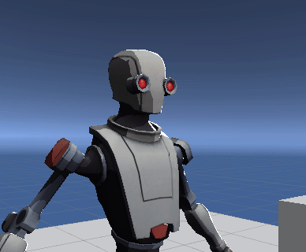
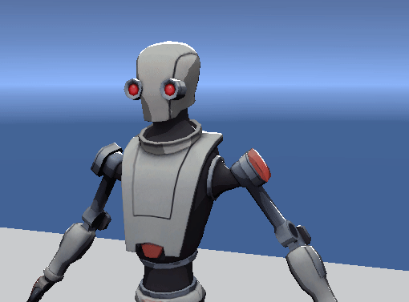
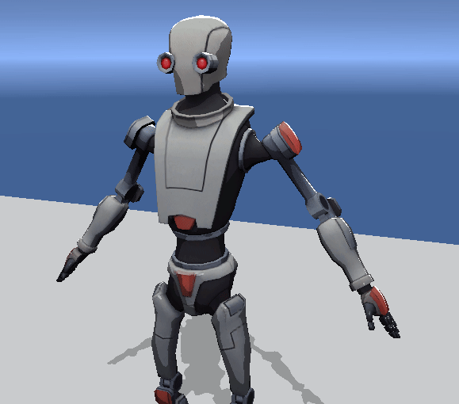
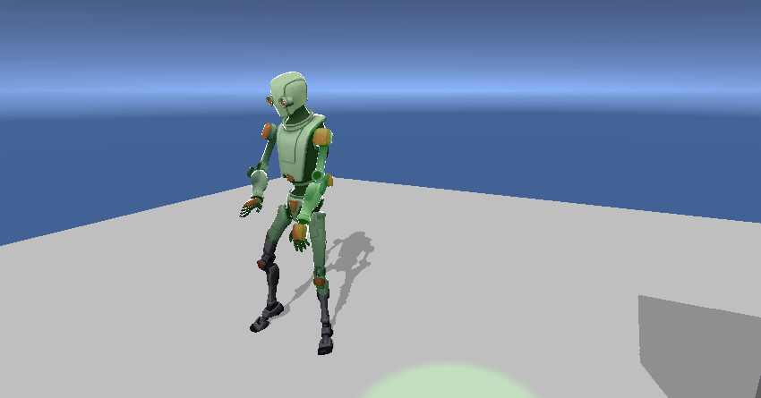
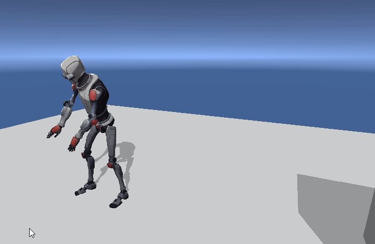

# URP Toon Shader for Unity
A toon shader compatible with Universal Rendering Pipeline.

### Features:
- 3-step cel-shading model 
- Rim lights 
- Specular highlights 
- Shadow receiving/casting 
- Additional lights 
- Ambient lighting 

## Usage
- Download the latest `.unitypackage` from the `Releases` section and add it to your project.
- Create a material and choose `DELTation/Toon Shader` in the shader dropdown list.

## Notes
- Developed and verified on Unity 2019 LTS and URP package v. 7.3.1 