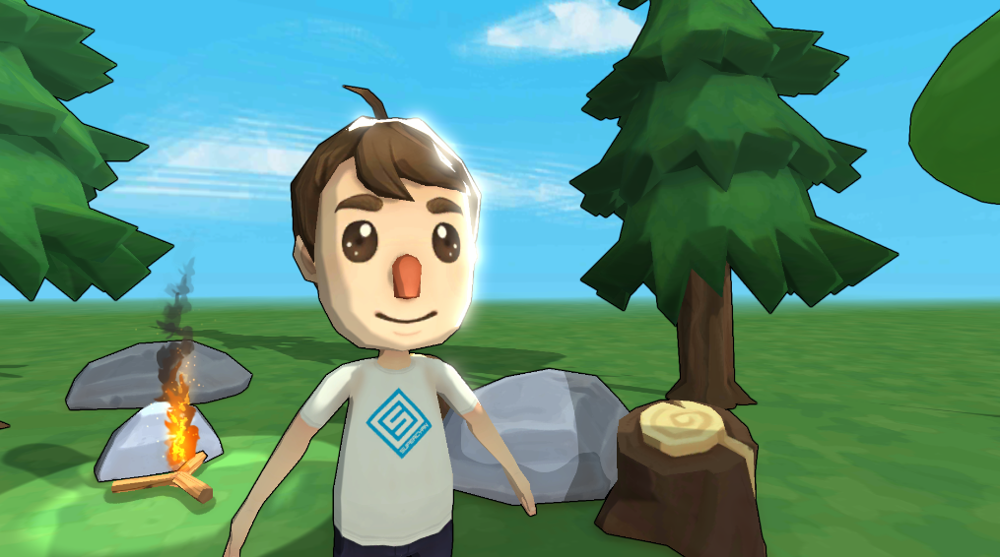
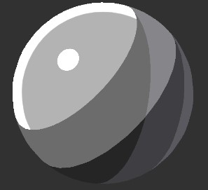
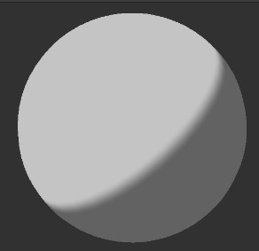
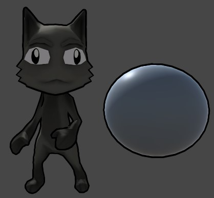
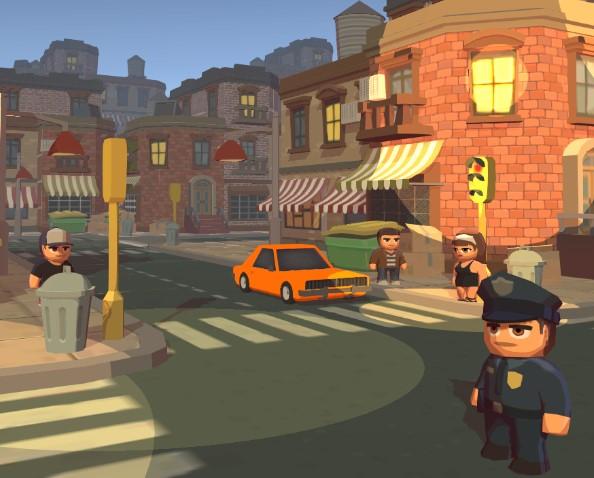
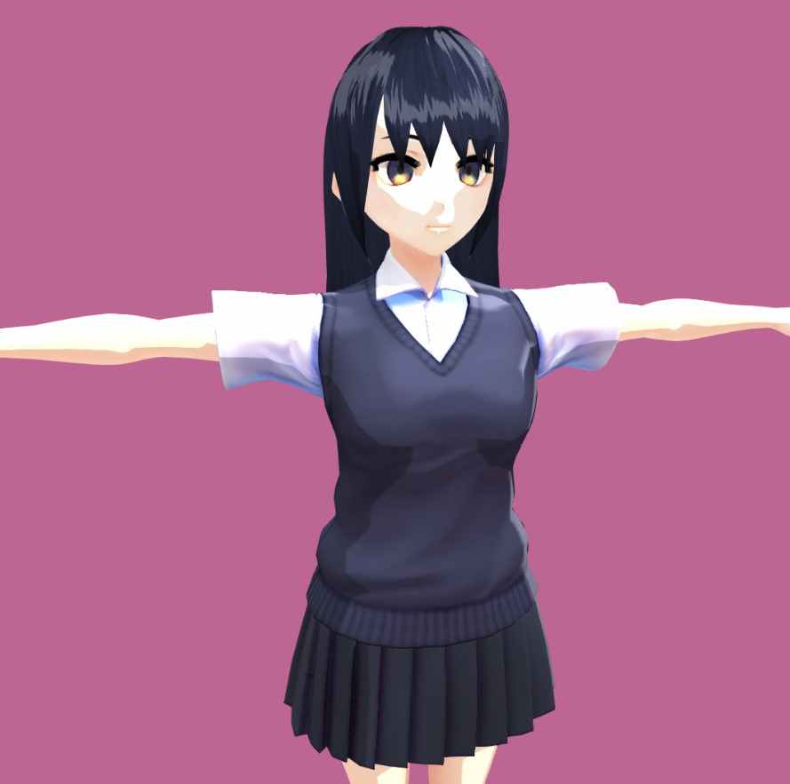
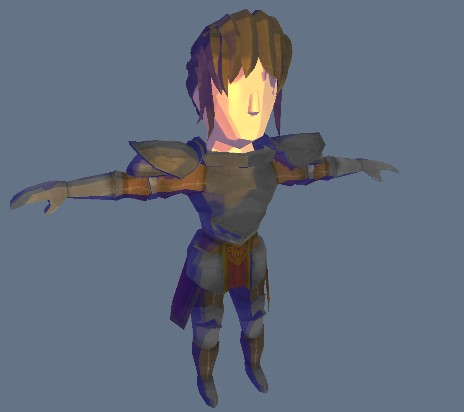
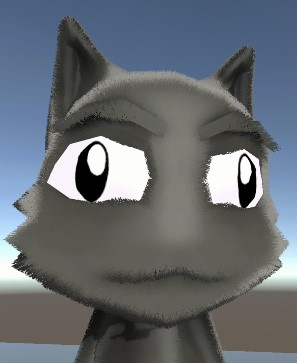

# URP Toon Shader for Unity
A toon shader compatible with the Universal Rendering Pipeline.
> Developed and verified with Unity 2020.3.0f1 LTS and URP package 10.3.2



### Table of Contents

[Toon Shader Capabilities](#toon-shader-capabilities)  
[Toon Shader (Lite) Capabilities](#toon-shader-lite-capabilities)  
[Inverted Hull Outline](#inverted-hull-outline)  
[Installation](#installation)  
[Documentation](#documentation)  
[Examples](#examples)  
[Performance Benchmark](#performance-benchmark)  
[Used Assets](#used-assets)  


## Toon Shader Capabilities



### Surface

- Opaque/Transparent with blending modes:
  - Alpha/Premultiply/Additive/Multiply
- Alpha Clipping
- Culling
  - Back/Front/Off

### Color

- 2 or 3-step ramp with configurable thresholds and smoothness
- Ramp textures
- Normal Maps
- Main light
- Additional lights 
  - per-vertex or per-pixel, depending on URP settings
  - optional specular highlights
- Casting and receiving shadows
- Configurable shadow color (both in multiplicative and "pure" modes)
- Emission
- Rim lighting (Fresnel effect) and specular highlights with HDR color support (e.g. for bloom)
- Anisotropic specular (e.g. for hair)
- Fog
- SSAO
- Environment Lighting
- Baked lights and shadows 
  - Dynamically receive via light probes 
  - Contribute to bake process ("meta" pass)
- Vertex Color

### Performance

- SRP Batcher compatibility
- GPU Instancing

## Toon Shader (Lite) Capabilities



### Color

- 2-step ramp with configurable threshold and smoothness
- Main light (per-vertex or per-pixel)
- Casting shadows
- Configurable shadow color
- Fog
- Vertex Color

### Performance
- SRP Batcher compatibility
- GPU Instancing

## Inverted Hull Outline

A simple and performant outline shader. Renders outlines of objects on certain layers via a Renderer Feature.



## Installation
### Option 1
- Open Package Manager through Window/Package Manager
- Click "+" and choose "Add package from git URL..."
- Insert the URL: https://github.com/Delt06/urp-toon-shader.git?path=Packages/com.deltation.toon-shader

### Option 2
Add the following line to `Packages/manifest.json`:
```
"com.deltation.toon-shader": "https://github.com/Delt06/urp-toon-shader.git?path=Packages/com.deltation.toon-shader",
```

## Documentation
[Forest Demo Breakdown](https://github.com/Delt06/urp-toon-shader/wiki/Forest-Demo-Breakdown)

## Examples









## Performance Benchmark
Lit vs. URP Toon Shader vs. Toony Colors Pro (Hybrid)

> The results are obtained with Mali Offline Compiler.

| Shader Type               | Vertex Shader Cycles (L/S) | Fragment Shader Cycles (L/S)|
|---------------------------|----------------------------|-----------------------------|
| Lit                       | 9                          | 15                          |
| URP Toon Shader           | 12                         | 10                          |
| Toony Colors Pro (Hybrid) | 7                          | 15                          |

> L/S = Load/Store.


### Configuration
```
Hardware: Mali-G78 r1p1
Architecture: Valhall
Driver: r25p0-00rel0
```

### Enabled keywords
Lit:
```
Global Keywords: FOG_LINEAR _ADDITIONAL_LIGHTS _ADDITIONAL_LIGHT_SHADOWS _MAIN_LIGHT_SHADOWS _MAIN_LIGHT_SHADOWS_CASCADE  _SHADOWS_SOFT
Local Keywords: _EMISSION
```

URP Toon Shader:
```
Global Keywords: FOG_LINEAR _ADDITIONAL_LIGHTS _ADDITIONAL_LIGHT_SHADOWS _MAIN_LIGHT_SHADOWS _MAIN_LIGHT_SHADOWS_CASCADE _SHADOWS_SOFT 
Local Keywords: _ADDITIONAL_LIGHTS_ENABLED _ENVIRONMENT_LIGHTING_ENABLED _FOG _FRESNEL _RAMP_TRIPLE _SPECULAR
```

Toony Colors Pro (Hybrid)
```
Global Keywords: FOG_LINEAR TCP2_HYBRID_URP _ADDITIONAL_LIGHTS _ADDITIONAL_LIGHT_SHADOWS _MAIN_LIGHT_SHADOWS _MAIN_LIGHT_SHADOWS_CASCADE _SHADOWS_SOFT 
Local Keywords: TCP2_REFLECTIONS_FRESNEL TCP2_RIM_LIGHTING_LIGHTMASK TCP2_SHADOW_LIGHT_COLOR
```

## Used Assets
- [UnityFx.Outline](https://github.com/Arvtesh/UnityFx.Outline)
- [Animated Mech Pack](https://quaternius.com/packs/animatedmech.html) by Quaternius
- [RPG Character Pack](https://quaternius.com/packs/rpgcharacters.html) by Quaternius
- [Environment Pack: Free Forest Sample](https://assetstore.unity.com/packages/3d/vegetation/environment-pack-free-forest-sample-168396) by Supercyan
- [Character Pack: Free Sample](https://assetstore.unity.com/packages/3d/characters/humanoids/character-pack-free-sample-79870) by Supercyan
- [The Free Medieval and War Props](https://asststore.unity.com/packages/3d/props/the-free-medieval-and-war-props-174433) by Inguz Media
- [Stone](https://assetstore.unity.com/packages/3d/environments/landscapes/stone-62333) by Vsify
- [Hair Shader 1.0](https://assetstore.unity.com/packages/tools/hair-shader-1-0-117773) by RRFreelance / PiXelBurner
- [Toony Tiny City Demo](https://assetstore.unity.com/packages/3d/environments/urban/toony-tiny-city-demo-176087) by Marcelo Barrio
- [Anime Character : Arisa](https://assetstore.unity.com/packages/3d/characters/anime-character-arisa-free-remakev2-contain-vrm-164251) by 戴永翔 Dai Yong Xiang
